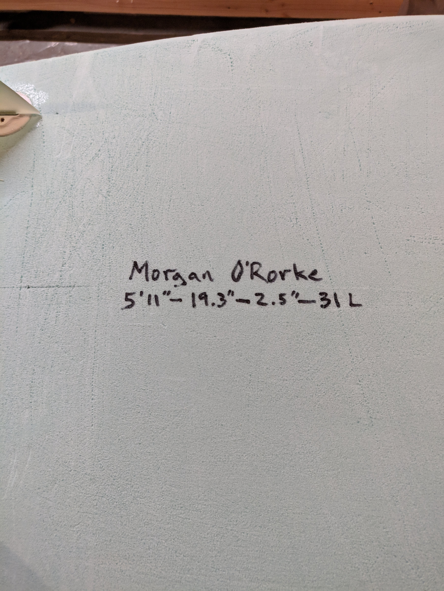

---
author:
- Morgan O’Rorke
date: August 2020
title: XPS Build Document
---

# Board Design

To aid in ending my  5 year long surfing hiatus, I was looking for a
shortboard with a bit more volume while still being short enough to make
late drops at hollow New England beach breaks. I picked up a file from
the Shape3d design archives (called the [Shape3d
Warehouse](https://www.shape3d.com/Warehouse/Default.aspx)) and made
some small changes to dimensions and curves as I saw fit. Here is what I
ended up with:

<figure>
<figcaption aria-hidden="true">Board dimensions</figcaption>
</figure>

Note: Disregard the fin and leash plug positions on this drawing, I used
the standard thruster fin positioning from
[Greenlight](https://greenlightsurfsupply.com/pages/how-to-shape-and-build-your-own-surfboard)’s
design templates.

I used these measurements and a batten to create outline and rocker
templates on a sheet of 1/8" MDF.

# Making the Blank

I used a sheet of Kingpsan GreenGuard XPS from Lowe’s ([Kingspan
Insulation R-12-in x 4-ft x
8-ft](https://www.lowes.com/pd/Kingspan-Insulation-Common-2-in-x-4-ft-x-8-ft-Actual-2-in-x-4-ft-x-8-ft-1-R-10-Unfaced-Polystyrene-Foam-Board-Insulation/999972968))
for the blank. An assistant at Lowe’s ripped the sheet in half and took
18" off the end so I could fit it in my car and, even with the new
dimensions, it was a very tight fit in my GTI. Initially, I tried
getting a Pink Panther sheet ([FOAMULAR 250 2 in. x 48 in. x 8
ft.](https://www.homedepot.com/p/Owens-Corning-FOAMULAR-250-2-in-x-48-in-x-8-ft-R-10-Scored-Squared-Edge-Insulation-Sheathing-52DD/202085962))
from Home Depot, but they wouldn’t rip the sheet so transporting it
would’ve been very difficult.

Now I had two pieces of foam that were approximately 2"x24"x78" that had
to be glued together to get the desired 2.5" thickness in the final
board. I prepared both faces with 40 grit sandpaper and, in an effort to
improve the bonding, created ample score marks for the adhesive to fill;
XPS is notorious — in the surfboard-building industry — for being
difficult to bond with due to the closed-cell structure of the foam. I
created a make shift rocker table using some stacked boards and a lot of
clamps and weights. My preferred rocker table would have placed the glue
line directly in the center of the finished board so that the glue line
would only be visible around the rails, but I ended up just stacking
boards to ensure I could fit the rocker template in the blank.

<figure>
<figcaption aria-hidden="true">Remnants of the rocker table</figcaption>
</figure>

Happy with the curve, I dumped all 4oz of my adhesive — [Original
Gorilla
Glue](https://www.homedepot.com/p/Gorilla-4-oz-Original-Gorilla-Glue-50004A/100141832)
— over one side of the foam and used some scrap wood to spread it out as
best I could. The layer was much thinner than I would’ve liked, but I
held out hopes that the glue would expand and form a sufficient layer
for bonding to occur. I sprayed the glue with water to activate, stacked
the second piece of foam, and loaded up the blank with weights and
clamps. In hindsight, this was not nearly enough glue and I ran into
problems down the road with the two layers separating during the shaping
process. This was approximately 468 in2 of bonding area per
oz of glue, I would recommend shooting for 150-200 in2 per
oz. Since Gorilla Glue is expensive, I would also recommend tracing the
board outline on the bonding surface (with some margin) and making an
effort to get a good glue layer in this area.

# The Hotwire

I jerry rigged the hotwire using a DC power supply, some scrap wood, and
stranded picture hanging wire. I experimented with the voltage until I
could smoothly cut through scrap pieces of foam.

<figure>
<figcaption aria-hidden="true">Jerry rigged hotwire</figcaption>
</figure>

I would highly recommend **NOT** using picture wire to hotwire, I had a
lot of breakages and had to be very careful with the voltage and speed
with which I cut. In fact, one of these breakages resulted in the hot
wire sinking into the foam and cutting below the template resulting in a
thinner blank in the tail area. I ended up gluing another piece of foam
over this to get some thickness back in the tail as there might not have
been enough room for the fin boxes.

# Shaping

With the Gorilla Glue dry, I unclamped and unloaded the blank, and fixed
the rocker templates to either side. I did my best to line up the
templates using brad nails as guides and bar clamps to hold the
templates to the foam — a better way to do this would be to screw the
template into the blank. I had a friend help with hotwiring the rocker,
we moved slowly and pulled on the U-frame to keep the wire as straight
as possible. As mentioned in the previous section, the stranded wire was
not a great hotwire material. We had a lot of difficulty keeping the
wire from sagging into the foam and lagging in the center — the cutting
front ended up being quite curved which made it difficult to accuractly
follow the templates. During this process, the hotwire broke and ate
into the blank below the template resulting in a very thin tail area. I
decided to fix this by re-gluing the pieces of foam that had been
removed from the area. Once this dried, I had to re-align the templates
and hotwire again. With the rocker cut, I traced the outline onto the
deck and cut it out with a close quarters hacksaw; this worked okay, but
there are better tools for the job — a fine-toothed pull saw would be my
choice. With the general shape cut, I removed material with a 24" 2x4
wrapped in 40grit using makeshift calipers to guage the thickness. I
also cleaned up the outline and made sure the sides were as square as
possible before I cut the rails.

At this time, I noticed a pretty severe delamination between the layers
near the nose (see Figure
<a href="#fig:delam" data-reference-type="ref" data-reference="fig:delam">1</a>.
The glue was too thin here, and I was able to peel back the top layer of
foam; there was also a gap in the tail area where it had been re-glued.
I purchased 2 more ounces of Gorilla Glue and fixed these mistakes. I
injected glue between the nose layers and clamped them together with
foam to protect the rough-shaped blank. I also filled in the tail gap
using a lot of glue to make sure it would expand and fill the whole area
(see Figure
<a href="#fig:outline_tail" data-reference-type="ref" data-reference="fig:outline_tail">5</a>).

<figure>
<figcaption aria-hidden="true">Rough shaped blank showing delamination area near nose</figcaption>
</figure>

Note: In Figure
<a href="#fig:outline_tail" data-reference-type="ref" data-reference="fig:outline_tail">5</a>,
the gap between foam layers is visible.

<figure>
<figcaption aria-hidden="true">Outline and rocker cut - tail view</figcaption>
</figure>

<figure>
<figcaption aria-hidden="true">Outline and rocker cut - tail view</figcaption>
</figure>

For the rails, I used
[Greenlight](https://greenlightsurfsupply.com/pages/how-to-shape-and-build-your-own-surfboard)’s
"modern" thin rail measurements to mark the rail bands. With the points
marked, I used a batten to draw a smooth line for the bands. I started
with the bottom tuck and used the sanding block to remove material until
I hit the band, then I rounded the edges until it was smooth in the
hand. I started on the deck bands with the sanding block. That was too
slow so I moved to a belt sander which worked okay, but it did burn the
foam in a few spots so I decided to use the close quarters hacksaw to
finish the bands, this was the quickest and easiest method. I used a
piece of scrap XPS with sandpaper stapled to it as a sanding block, this
worked well to blend the rail band cuts together.

I decided to do a single concave through the bottom transitioning to
flat through the fins. I went to town with the belt sander, making
vertical lines to shape in the concave and a straight edge to eye the
depth. This was pretty rough on the foam and glue lines; right above the
back fin is where the foam layers meet and the belt sander took some
chunks out of it because the foam and glue were too thin to hold
together — I had to fix this later. With the majority of material
removed, I used the foam sanding blocks to blend until there was a
smooth transition.

<figure>
<figcaption aria-hidden="true">Final shape</figcaption>
</figure>

<figure>
<figcaption aria-hidden="true">Final shape</figcaption>
</figure>

<figure>
<figcaption aria-hidden="true">Dimensions</figcaption>
</figure>

# Fin Boxes and Leash Plug

I decided to use FCS Fusions on this build, primarily because they
seemed easy to install without shelling out the money for the install
jigs — this build was all about budget, hence the reason for the XPS
blank. I tried making a homemade jig, but I didn’t have a bearing for my
[Harbor Freight trim
router](https://www.harborfreight.com/14-in-24-amp-trim-router-62659.html)
so I decided to freehand the holes; I practiced two or three times on
some scrap foam to tune the depth and steady my hand. I carefully traced
the fin box outlines onto the blank and slowly freehanded the holes, I
stopped a few times to test fit the boxes before I removed more
material. In the end, this method was surprisingly successful, I got a
very tight fit into the foam and it didn’t take too long either.

For the leash plug, I tried a forstner bit, but it wandered and tore up
the foam so I just freehanded with the router... again.

I mixed up some epoxy and cabosil and set the leash plug and fin boxes.
I used a template to fix the side fins at 7 degree cant.

There was extra epoxy left so I used it to fix the mistakes from
earlier, I glued in some of the pieces of foam that were torn out near
the back fin. Some of the Gorilla Glue spots were also pretty weak and
porous, so I filled these in with epoxy to get a harder, smooth surface.

<figure>
<figcaption aria-hidden="true">Fins and Glue Spots</figcaption>
</figure>

# Laminating

My plan for this board was to do 2 layers of 4oz warp E-glass on the
bottom, 3 layers on the top, a layer of Cerex nylon fabric on the deck,
and uni-directional carbon fiber tape on the rails. However, my order
arrived with no carbon fiber tape **and** I couldn’t find any Cerex
suppliers so I had to make do with what I had; I did pick up some [white
nylon tulle
fabric](https://www.joann.com/matte-tulle/zprd_10449056a.html?dwvar_zprd__10449056a_variationAttribute=401703&quantity=1)
from Jo-Ann’s, though. The tulle fabric would go directly against the
foam on the deck with the goal of creating a resin-rich layer to reduce
the risk of delamination and to increase the laminate thickness to
increase buckling strength.

I calculated how much resin I would need based on the following formula
*m**r* = *A**f* \* *ρ**A**f* \* *x*
where *m**r* is the mass of the resin needed,
*A**f* is the area of the fabric,*ρ**A**f* is the
areal density of the fabric, and x is a multiplier to account for an
imperfect lamination process. Initially, I used an x of 1.2, but had to
bump this up to 1.5 to fully saturate the laminate.

I laminated the bottom first, wrapping both layers of glass about 1.5
inches onto deck. At first, I mixed 10.4oz resin, but had to mix up 4
more ounces to fully wet out the bottom. I saturated both layers at
once, which was fairly easy to do if you let the resin soak its way into
the fabric rather than using the squeegee to work the resin in.

<figure>
<figcaption aria-hidden="true">Bottom laminate</figcaption>
</figure>

<figure>
<figcaption aria-hidden="true">Bottom laminate</figcaption>
</figure>

I did have a final issue from shaping that I intended to fix here, the
shaped blank had lost rocker due to thinness in the tail and relaxing of
the glue lines. At this point, the tail had negative rocker
(<a href="#fig:rocker" data-reference-type="ref" data-reference="fig:rocker">7</a>).

<figure>
<figcaption aria-hidden="true">Tail rocker issue</figcaption>
</figure>

To fix this, I let the resin get slightly tacky and placed light weights
on the tail to bend the rocker back into the board, using parchment
paper against the tacky resin to protect the laminate. This worked very
well and I didn’t notice any springback when removing the weights.
Ideally, I would’ve liked to laminate the top as soon as the bottom was
dry enough to flip, but I had to wait for this bottom layer to set so
the rocker would hold.

Despite my efforts, the laps were not fully saturated and I did have to
cut out some dry spots; I also had to do a bit of sanding to knock down
some high spots.

On to the deck... I laminated the deck in two batches: first the nylon
tulle fabric and one layer of glass, then the last two layers of glass.
I cut the tulle fabric just inside the laps so it was only sitting on
foam, then the next layer of glass so it I had about 1.5in laps onto the
bottom. I mixed 6.5oz of resin here, hoping that the majority would make
its way into the nylon mesh and the rest of the fiberglass would be
saturated by the next layers. Saturating the nylon tulle fabric was
fairly difficult, I did have to do a lot of work with the squeegee to
push resin from the fiberglass into the tulle fabric. With the top layer
tacky, I moved onto the final two glass layers with 12oz of resin - this
was the perfect amount. The laminate on the deck came out beautifully
with very few dry spots and only a small amount of sanding required on
the laps.

<figure>
<figcaption aria-hidden="true">Deck laminate</figcaption>
</figure>

I did a lean hotcoat on both sides using 6oz resin (per side). I did
want to experiment with leaving the textured weave on the deck, but had
some concerns that the glass might be too harsh on my wetsuit/chest.
When sanding the hotcoat, I did hit weave in a few spots, but nothing
too bad.

<figure>
<figcaption aria-hidden="true">Finished board</figcaption>
</figure>

<figure>
<figcaption aria-hidden="true">Finished board</figcaption>
</figure>

<figure>
<figcaption aria-hidden="true">Finished board</figcaption>
</figure>

<figure>
<figcaption aria-hidden="true">Finished board</figcaption>
</figure>

# Remarks

My predicted board weight using calculated fabric weight, the above
equation for resin quantities (using 1.5 resin multiplier), the
calculated blank weight (using predicted volume and XPS density), and
hotcoat quantities was 5.9lbs. After sanding, the board came out to
5.6lbs. I did play around with the resin multiplier during the
laminating process, and I did neglect the weight of the tulle fabric,
fin boxes, leash plugs, and resin required for install, but I think my
final resin multiplier was actually around 1.5 or so — this is what I’ll
shoot for next time around. I think my final shape had slightly less
volume than predicted and my predicted fabric areas were accounting for
slightly longer laps.

And while I did fix the tail rocker issue, I did notice I had pretty
excessive nose rocker by the time the board was done. I’m not sure if
additional rocker was bent in during the laminating process or if it
happened as a result of the shaping or gluing.

# Ride Report

Honestly, this board rips. It definitely needs some push to get it
going, but it feels super high-performance and very light and responsive
under foot. It’s still a bit thinner in the tail than I’d like, but I
don’t have too much of a problem getting into waves. The board was
supposed to be 31L, but I think it is a bit less than that; when sitting
on the board, the water line is up to my mid-lower chest (Bodyweight =
185lbs).

As for strength, this thing is close to bulletproof. I’ve ridden it 4
times in pumping New England hurricane surf and the board is spotless —
even after multiple air drops into the flats, I still have no pressure
dings anywhere on the board.
