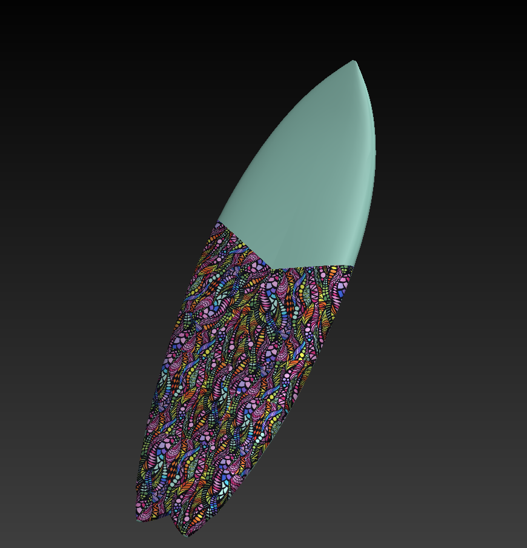
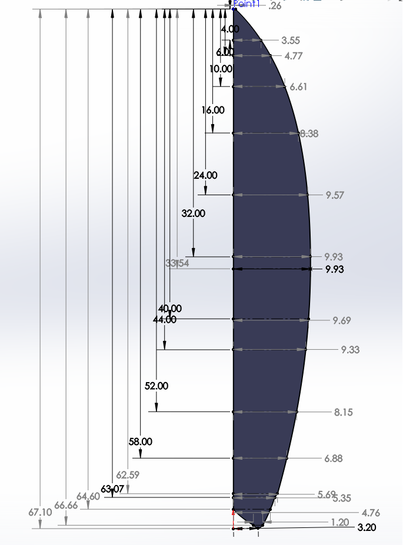
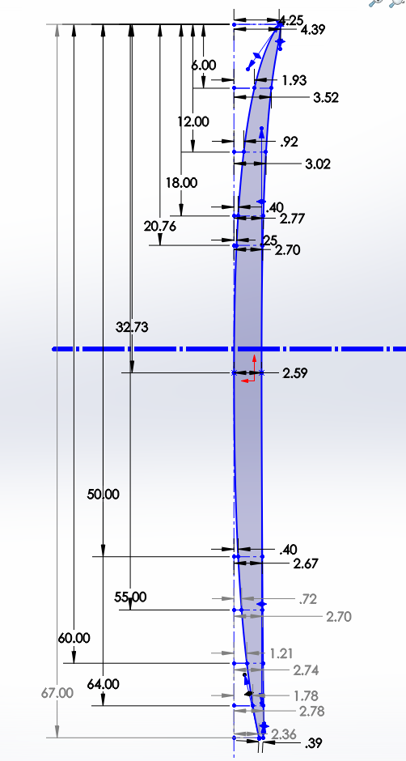
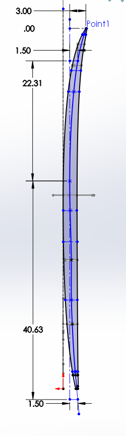
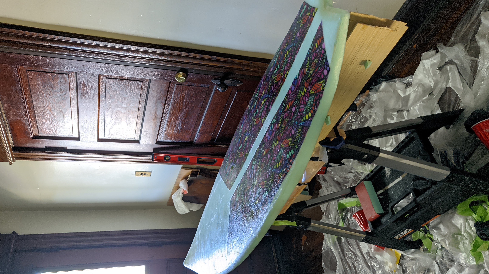
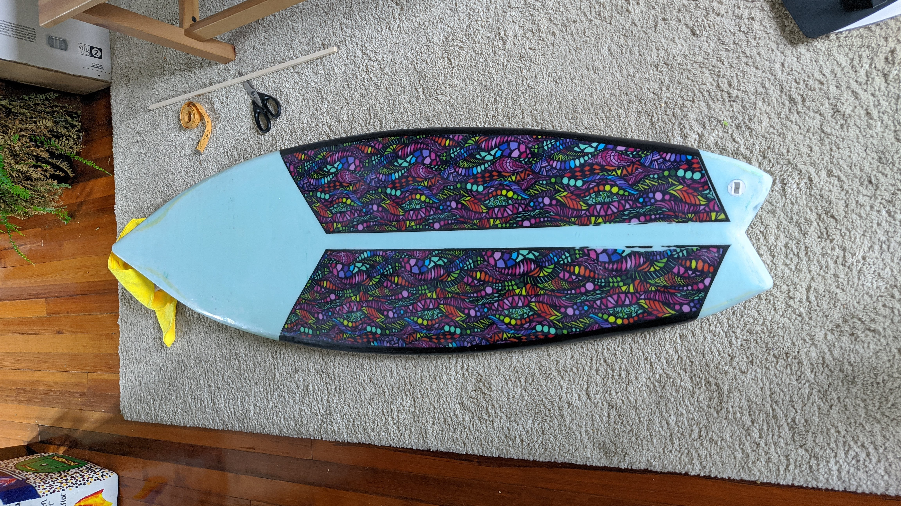

---
author:
- Morgan O’Rorke
date: July 2021
title: XPS2 Build Document
---

# Board Design

With extra materials from my previous build and the desire for a board to satisfy the surprisingly (to me) lackluster New England surf, I set out on making a performance fish. All designs were done in Solidworks with inspiration coming from Pyzel's Astro Pop model.

<figure>
<figcaption aria-hidden="true">Final Solidworks Model</figcaption>
</figure>

<figure>
<figcaption aria-hidden="true">Outline Template</figcaption>
</figure>

<figure>
<figcaption aria-hidden="true">Board Rocker Template</figcaption>
</figure>

This time I tried to avoid having the glue seam making unwanted appearances on the bottom and deck of the board - it caused unnecessary headaches during the shaping process. To do this, I dropped a centerline on my desired cross-section and dropped measurements from the center that correspond to the height of a 2x4 (or two 2x4s).   
<figure>
<figcaption aria-hidden="true">Blank Rocker Template</figcaption>
</figure>

# Build
<figure>
<figcaption aria-hidden="true">Lamination Drying</figcaption>
</figure>

<figure>
<figcaption aria-hidden="true">Finished Board (Paint removed on lower half for traction pad placement)</figcaption>
</figure>

# Remarks

Cotton fabric inlays take MUCH more resin to saturate than you expect. I had to drop down to two layers of fiberlgass on the deck because I ran so low on resin; the board is still very strong and has no pressure dings after ~10 outings.

# Ride Report

A wave catching machine...

I do wish it had a bit more volume in the tail since it does tend to drag a bit in weak surf.

On my first day out with it someone stopped me and said "that looks like a really fun shape." Pretty big compliment considering I've never had that happen (even with "professionally"-built boards) in my ~15 years of surfing.